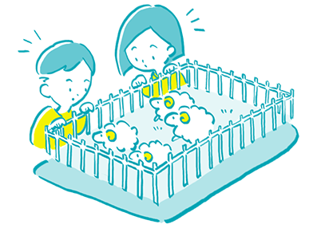
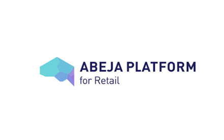
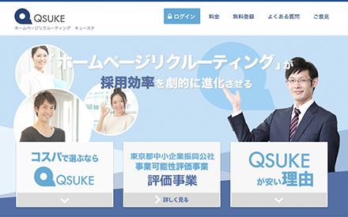
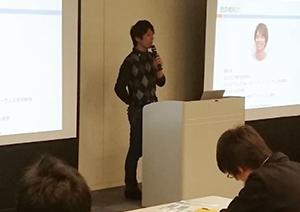



	

	
新規事業では、ビジネスアイデアに合わせてソフトウエア設計の見直しを重ね、柔軟に進化させていくことが重要です。次々に出てくる「こうしたい」を一緒に形にしてくれる開発チームは、ビジネスの強い味方となります。 
	mofmof inc.の「開発チームレンタル」のサービスは、従来の受託制作のように始めから終わりまで一続きに開発を進めるやり方ではなく、実際にソフトウェアの動かしながら、仕様変更を繰り返していく作り方を提供しています。
	

	

	<a href="/service">
	

	<button class="button middle service_button button_primary">サービス</button>
	

	</a>

<section class="sp_bg">
	

		<h2 class="ttl_center">MERIT月額制開発チームレンタルのメリット</h2>
	

	

		

		<a class="merit_link_area" href="/service/#merit01">
			

			
			

			<button class="button middle button_primary">MERIT.01</button>
			
高速で開発ができるため、 新規事業に向いている

		</a>
		<a class="merit_link_area" href="/service/#merit02">
			

			
			

			<button class="button middle button_primary">MERIT.02</button>
			
開発チームの進捗を可視化

		</a>
		<a class="merit_link_area" href="/service/#merit03">
			

			
			

			<button class="button middle button_primary">MERIT.03</button>
			
1人ではなく開発チームで 対応するため安心

		</a>
		

	

</section><!-- MERIT -->

<section class="section_bg_left">
	

		<h2 class="ttl_right">INTERVIEWクライアントインタビュー</h2>
	

	

		

			<a href="/interview/interview05.html">
			

			
			

			
株式会社ABEJA緒方さま

			
期待どおりの爆速開発。チーム全体でゴールを共有できる 体制が素晴らしい

			

			

			</a>
			<a href="#">
			

			
			

			
株式会社フライングライン代表取締役社長 鐘ヶ江さま

			
自分のプロダクト開発チームをしっかりと育成できているという実感

			

			

			</a>
			<a href="#">
			

			
			

			
合同会社ユキサキ代表 神野さま

			
シェアリングエコノミースターターパッケージを使って迅速にサービスリリースが出来た

			

			

			</a>
			<a href="#">
			

			
			

			
Career Live代表 北村さま

			
既存システム改修という制限下でうまく改善していけた技術力に満足

			

			

			</a>
			

			<a class="button_more" href="/interview">MORE</a>
			

		

	

</section><!-- INTERVIEW -->

<section class="section_bg_right sp_bg">
	

		<h2 class="ttl_left">WORKS開発実績</h2>
		

			<a href="/works/#works01">
			

			
			
WORKS.01

			<button class="button button_primary works_button">ABEJA Platform for Retail</button>
			

			</a>
			<a href="/works/#works02">
			

			
			
WORKS.02

			<button class="button button_primary works_button">RiLi.tokyo</button>
			

			</a>
			<a href="/works/#works03">
			

			
			
WORKS.03

			<button class="button button_primary works_button">Yondemill</button>
			

			</a>
			<a href="/works/#works04">
			

			
			
WORKS.04

			<button class="button button_primary works_button">QSUKE</button>
			

			</a>
			

			<a class="button_more" href="/works">MORE</a>
			

		

	

</section><!-- WORKS -->

<section>

</section>

<section class="section_info">
	

	<h2 class="ttl_center_s clearfix">INFOMATION mofmofのお知らせ<a href="#">more</a></h2>
	

	

		<a href="#">
		

			

			AIチャットボット,人工知能
			

			
DEC28

				
				人工知能チャットボット開催レポート。今後の人工知能の可能性について勉強会を開催いたしました。
			

			

		

		</a>
		<a href="#">
		

			

			AIチャットボット,人工知能
			

			
DEC28

				
				人工知能チャットボット開催レポート。今後の人工知能の可能性について勉強会を開催いたしました。
			

			

		

		</a>
		<a href="#">
		

			

			AIチャットボット,人工知能
			

			
DEC28

				
				人工知能チャットボット開催レポート。今後の人工知能の可能性について勉強会を開催いたしました。
			

			

		

		</a>
		<a href="#">
		

			

			AIチャットボット,人工知能
			

			
DEC28

				
				人工知能チャットボット開催レポート。今後の人工知能の可能性について勉強会を開催いたしました。
			

			

		

		</a>
		<a href="#">
		

			

			AIチャットボット,人工知能
			

			
DEC28

				
				人工知能チャットボット開催レポート。今後の人工知能の可能性について勉強会を開催いたしました。
			

			

		

		</a>
		<a href="#">
		

			

			AIチャットボット,人工知能
			

			
DEC28

				
				人工知能チャットボット開催レポート。今後の人工知能の可能性について勉強会を開催いたしました。
			

			

		

		</a>
		<a href="#">
		

			

			AIチャットボット,人工知能
			

			
DEC28

				
				人工知能チャットボット開催レポート。今後の人工知能の可能性について勉強会を開催いたしました。
			

			

		

		</a>
		<a href="#">
		

			

			AIチャットボット,人工知能
			

			
DEC28

				
				人工知能チャットボット開催レポート。今後の人工知能の可能性について勉強会を開催いたしました。
			

			

		

		</a>
	

</section><!-- INFOMATION -->

<section class="section_bg section_blog">
	

		

			

				<section class="blog_list_items">
					

					<h3 class="ttl_blog">BLOG</h3>
					<a href="http://everyday.mof-mof.co.jp/">MORE</a>
					

					<ul id="hatena_feed" class="article_list clearfix">
						<!-- mofmof blog -->
					</ul>
				</section>
				<section class="blog_list_items">
					

					<h3 class="blog_list_title02 clearfix">技術部</h3>
					

					<ul id="blog_feed" class="blog_list_tec">
						<!--  -->
					</ul>
				</section>
			

			

				

				<a class="page_nav_left" href="/about">
				

				
				<button class="button button_primary page_nav_button">mofmofとは</button>
				

				</a>
				<a class="page_nav_right" href="/recruit">
				

				
				<button class="button button_primary page_nav_button">採用情報</button>
				

				</a>
				

			

		

	

</section><!-- BLOG -->
